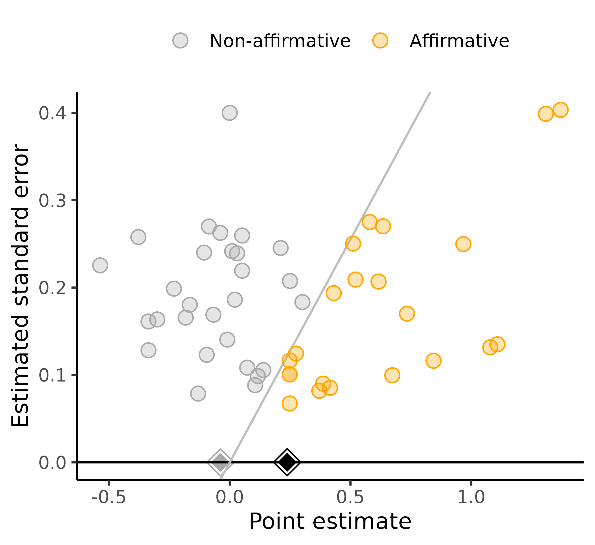
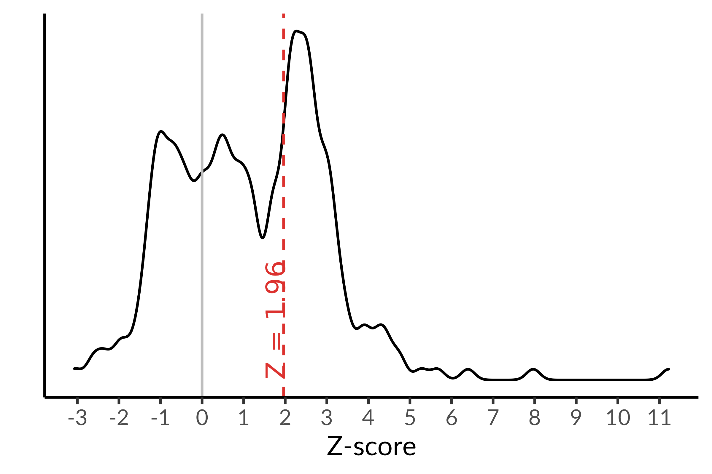

```{r, echo=FALSE}
knitr::opts_chunk$set(
  collapse = TRUE,
  comment = "#>",
  fig.path = "README-"
)
```

## How to use this website

This website provides interactive apps to conduct bias corrections and sensitivity analyses for meta-analyses with respect to within-study and across-study biases.

Underlying these apps is a set of R packages -- see the <a href="https://mathurlabstanford.github.io/multibiasmeta/articles/tutorial.html" target="_blank">Metabias packages tutorial</a> for an introduction to the packages.

<!-- <div class="apps-container"> -->

<div class="app-container">


<div>
<h2>Publication bias</h2>

<p>
This app conducts sensitivity analyses for publication bias in meta-analyses.

These analyses consider publication bias that favors affirmative studies (i.e., those with positive estimates and significant p-values) over nonaffirmative studies (i.e., those with negative or nonsignificant estimates). These analyses enable statements such as: "For publication bias to shift the observed point estimate to the null, significant results would need to be at least 30-fold more likely to be published than negative or nonsignificant results." Alternatively, you can consider shifting to a chosen non-null value or shifting the confidence interval to include the null or another value.
        
This app also provides a worst-case meta-analytic point estimate under maximal publication bias obtained simply by conducting a standard meta-analysis of only the negative and nonsignificant studies.
</p>

<p>
Please use the following citation:<br>
<a href="https://rss.onlinelibrary.wiley.com/doi/10.1111/rssc.12440" target="_blank">
Mathur MB & VanderWeele TJ (2020). Sensitivity analysis for publication bias in meta-analyses. _Journal of the Royal Statistical Society: Series C_, 69(5), 1091-1119.
</a>
</p>

<p>
<a href="https://mathurlabstanford.github.io/PublicationBias/" target="_blank">
<i class="fas fa-link" aria-hidden="true"></i>
PublicationBias package documentation
</a>
</p>

</div>

</div>


<div class="app-container">


<div>
<h2><em>p</em>-hacking</h2>

<p>
This app fits right-truncated meta-analysis (RTMA), a bias correction for the joint effects of <em>p</em>-hacking (i.e., manipulation of results within studies to obtain significant, positive estimates) and traditional publication bias (i.e., the selective publication of studies with significant, positive results) in meta-analyses.

Unlike publication bias alone, <em>p</em>-hacking that favors significant, positive results (termed "affirmative") can distort the distribution of affirmative results. To bias-correct results from affirmative studies would require strong assumptions on the exact nature of <em>p</em>-hacking. In contrast, joint <em>p</em>-hacking and publication bias do not distort the distribution of published nonaffirmative results when there is stringent <em>p</em>-hacking (e.g., investigators who hack always eventually obtain an affirmative result) or when there is stringent publication bias (e.g., nonaffirmative results from hacked studies are never published). This means that any published nonaffirmative results are from unhacked studies. Under these assumptions, RTMA involves analyzing only the published nonaffirmative results to essentially impute the full underlying distribution of all results prior to selection due to <em>p</em>-hacking and/or publication bias.
</p>

<p>
Please use the following citation:<br>
<a href="https://doi.org/10.31219/osf.io/ezjsx" rel="nofollow noopener noreferrer" target="_blank">
Mathur MB (2022). Sensitivity analysis for <em>p</em>-hacking in meta-analyses.
</a>
</p>

<p>
<a href="https://mathurlabstanford.github.io/phacking/" target="_blank">
<i class="fas fa-link" aria-hidden="true"></i>
phacking package documentation
</a>
</p>

</div>
</div>
<!-- </div> -->


## Bug reports

Submit bug reports by opening an issue on GitHub:
<a href="https://github.com/mathurlabstanford/metabias-apps" target="_blank">
<i class="fab fa-fw fa-github" aria-hidden="true"></i>
mathurlabstanford/metabias-apps
</a>
